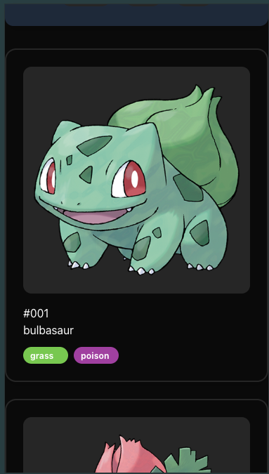
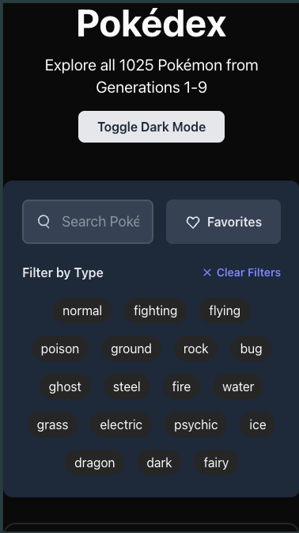
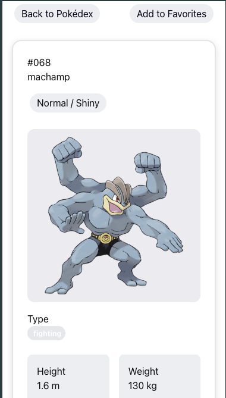
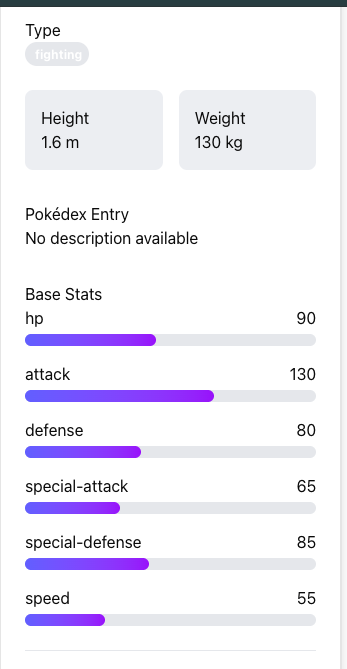
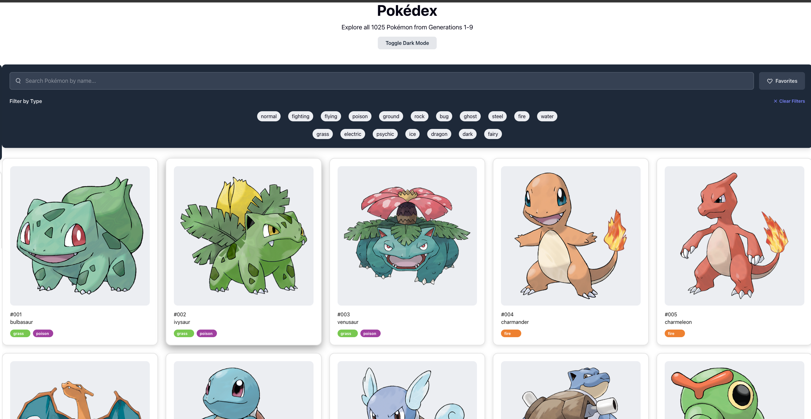
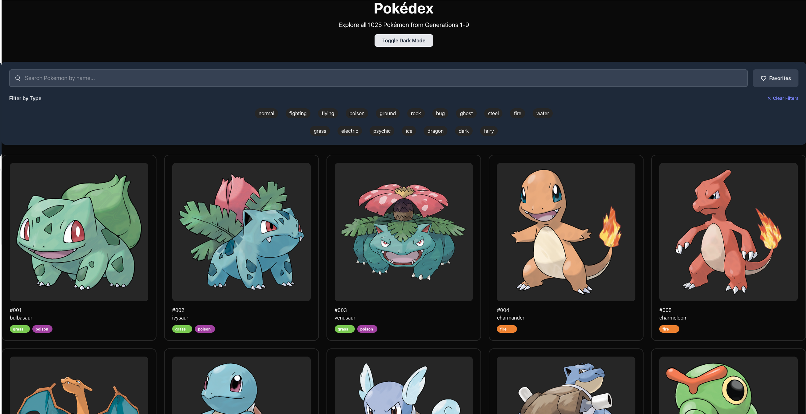
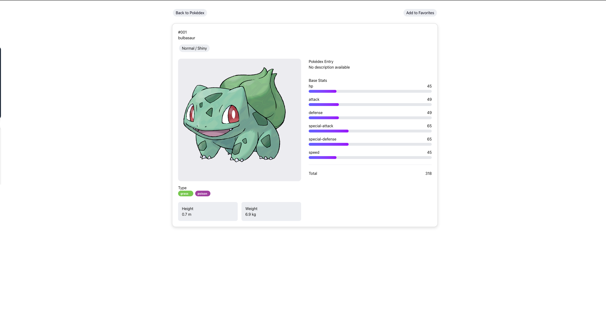
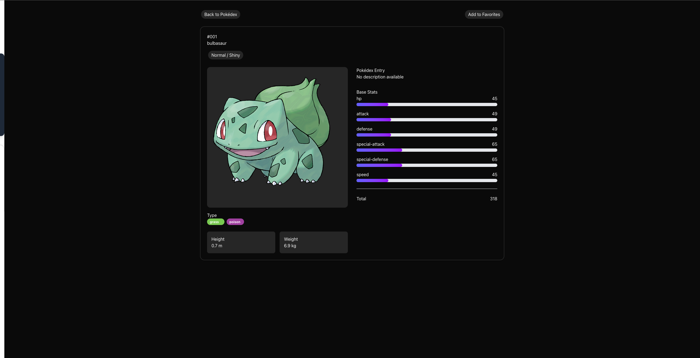

# Pokemon Database

This Project is a interactive web-based Pokedex application built with vanilla HTML, CSS and JavaScript.

The core funcitonality of the application allows users to browse through dynamically generated card, filter by type and search name in real time. each pokemon card is interactive providing a detailed view of said pokemon.

- [Here](https://shaqkori.github.io/TCi-projcet-2/) is a live preview of the website

## Table of Contents

- [Project Goals](#project-goals)
- [Features and Benefits](#features-and-benefits)
- [Deployment](#deployment)
- [Development](#development)
- [Responsivity](#responsivity)
- [Validation and Performance testing](#validation-and-performance-testing)
- [Bugs and Errors](#bugs-and-errors)
- [Images](#images)
- [Decleration of AI](#decleration-of-ai)
- [Colour Pallete](#colour-pallete)
- [Wire frames](#wire-frames)
- [UX / UI](#ui--ux)
- [Updates](#updates)

## Project Goals

- Dynamically render all the Pokemon in pokedex order on to the screen.
- Allow users to filter pokeomn by type
- Allow pokemon to be searched for by name
- Provide detail on individual pokemon when clicked on showcasing stats genus biometrics etc
- Have a theme toggle between dark and light mode

## Features and Benefits

- Dynamic Pokémon Listing Pokémon are fetched from the PokéAPI and rendered dynamically as interactive cards.

- Multi-Type Filtering (AND Logic) Users can filter Pokémon by selecting one or more types. Only Pokémon that match all selected types are displayed.

- Real-Time Search A live search bar allows users to filter Pokémon by name as they type, working alongside type filters.

- Interactive Pokémon Detail View Clicking a Pokémon card opens a detailed view showing stats, types, sprites, physical attributes, and Pokédex descriptions without navigating to a new page.

- Single-Page Application Behaviour (Vanilla JS) Page sections are conditionally shown and hidden to simulate SPA navigation using plain JavaScript.

- Shiny / Normal Sprite Toggle Users can switch between normal and shiny Pokémon sprites.

- Responsive Layout Built with Tailwind CSS to ensure the interface adapts across different screen sizes.

- Clean State Management Application state (selected types, search query, current Pokémon) is handled in JavaScript without external libraries.

## Deployment

- This website is deployed and hosted through GitHub Pages.
- Changes and modifications all happen through Github and are deployed through GitHub actions.

## Development

So the initial idea came from the [Pokdex Website](https://pokemondb.net/pokedex/shiny).

Using the [PokeAPI]("https://pokeapi.co/"). This is possible on the front end as it is open source and don't have to deal with the protection of private API keys.

The website functions as such where on load the inital 20 pokemon are loaded because of pagination, meaning we split up the api calls into chunks so that we dont overload the frontend with over 1000 api calls at onece. on the call it extracts the image pokemon number and loops through and displays the types which is all added to the pokemon card and then displayed to the screen through the render function. There is an event listener that listens for a scroll on the page which alerts to load more pokemon wich is tracked by a current offset function.

The type selection load by looping through the number of types then mapping them to a label id which styles them. Initialy i was using buttons for the types but then i realised i wanted to track if multiple are clicked so check boxes where better where tracked the true and false state through and event listsener wihch then adds that type to an array which can be use to filter out the pokemon on the screen, used with the .every and .some function which check if both types are include or just one. together its allowed to loop through the loaded pokemon which are all stored in an array and filter through and render the relevant ones. the clear filter button just clears the array but i did not add functionality to clear the colors of the button.

the search bar for the pokmeon works inside the filtering function where we have an empty variable search term and if that is not empty it filers through all the pokemon with the term but we use the startWith function which allows us to filter pokemon only starting with the search term.

The dark mode toggle simply applys the dark class on the document element which switches the colors based on the css variable we set and there is a transistion element so it looks seemless.

For the pokemon detailed as this is one page project its stored on the same page but there is a event listner on the pokemon card that listens for the a click on the card which calls a function to hide this section and only show the pokemon detail. We dont want to take it to another page as we need the data to persist and not reload and without using local storage it would be complicated so instead a one page app is better for this as the data is maintained. for the pokemon detail section there is a function that manipulates the data from the initial api call and appends it as elements to the page

### Challenges faced

The main challenge faced throughout this project was rendering issues and how i thought about rendering.

The way my code initialy worked before the fix was, i would have multiple differnt function trying to render to the screen for example my type filtering function and my general rendering function of the pokemon card. When a type button was clicked it would render the matching type but then after that the rendering functino would take over and just start rendering pokemon continuing from that number.

I was fetching filtering rendergn and reacting to checkboxes all at the same time whislt none of these function where aware of each other. The code still worked fine but internaly it was a war between these functions.

Also a big issue is i was rebuliding the DOM every time a change was made as my inital thought process was: - Event → DOM change → DOM change → DOM change. This can lead to heavy performance issues recreating elements for each change. From what i've learn the DOM should be treated as a render target, not the source of truth.

Initially, Pokémon were rendered out of numerical order. This occurred because Pokémon data was fetched using multiple network requests, and network requests are asynchronous and do not resolve in a guaranteed order. As a result, some Pokémon with higher IDs were rendered before lower ones. By waiting for all fetch promises to resolve (e.g., using Promise.all) before rendering, the application avoids race conditions caused by non-deterministic network timing.

### Future improvements

Whilst the undertaking of this project was intense there is still a large room for improvement going forward. First of all i want to find a way around the limitation without overloading the user, as an "issue" you can notice is that you cannot get results if u search for a pokemon that has not yet been loaded which the user may mistake for a broken application. Also i wanted to add a favourites feature where the user can filter by there favourite pokemon which works teh same way the type filteriing and search bar works.

seperately one big issue the overall design of the appliation is very bland as i have not had much time to focus on the look of the application i would definately like to work towords improving the ux and ui so it feels more friendly.

## Responsivity

The website uses the Tailwind library to ensure responsiveness with the grid property displaying 4 columns on larger screens and decreases as the screen gets smaller

## Validation and Performance testing

See [Here](./validation.md) for Performance testing and validation results

### Screen Shots - Mobile

### Screen Shots - Desktop

## Images

The pokemon sprites are taken from the pokemon official art work

## Decleration of AI

AI was used in the development of the design and structure of the website using FIGMA AI which generateed wireframes that i could use instead of having to think about the design my self. As well as design AI was used to allow my code to follow best practices to the use of promises for fetching all the data rather thand fetching sequentially and ai was used to help with overall syntax for example it gave me the idea to use .some and .every functions to filter out pokemon types, as before i was just using just a base filter which did not filter properly as you would not get pokemon with multiple types just the first type selected.
AI was also used for the CSS and tailwind sections which allowed me to focus mainly on javascript more than anything else.
