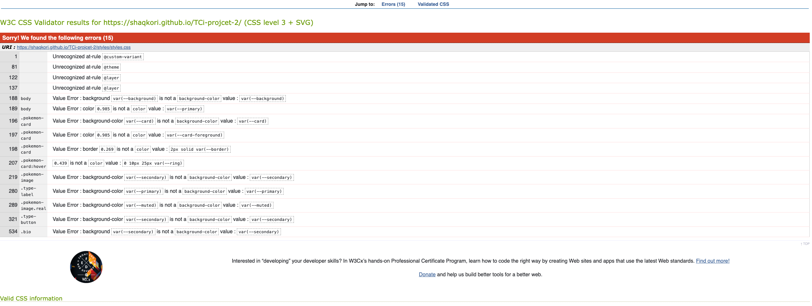
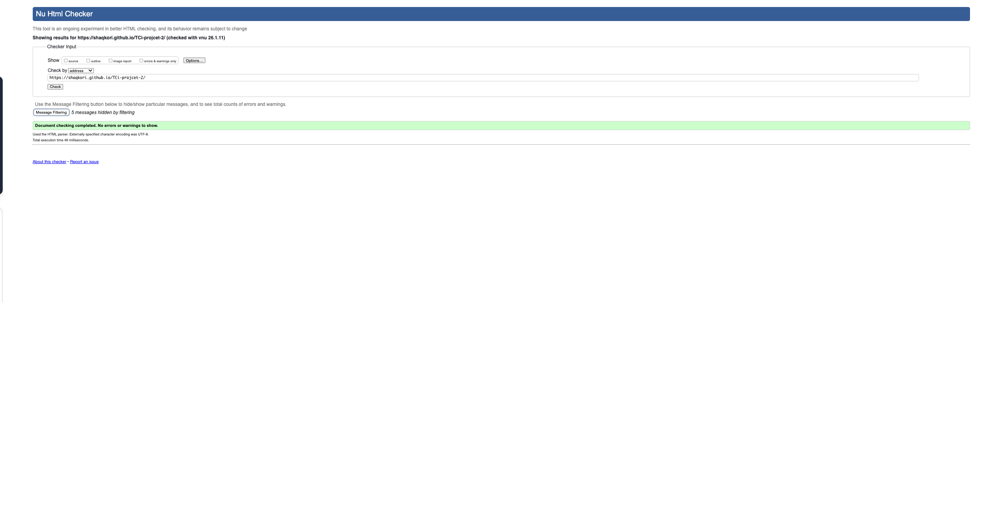
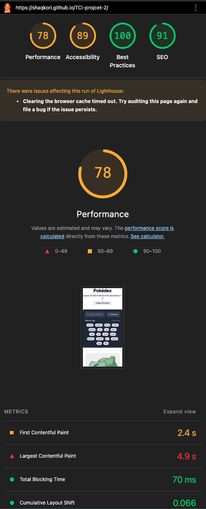

# Table of Contents

- [CSS Validation](#css-validation)
- [HTML Validation](#html-validation)
- [Performance Testing](#performance-testing)

## CSS Validation

The errors here return are due tp a CSS validator vs modern tooling mismatch, not real CSS errors.

## HTML Validation

No HTML errors returned

## Performance testing

Tested with the light house tool on chrome dev tools.

Gives u a score from 0 - 100 on the following categories:

- Accessibilty
- Performance
- SEO
- Best practices

with 0 - 49 being bad 50-89 being medium and 90 - 100 being good

